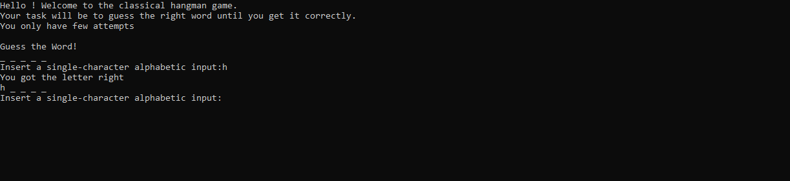

## Table of contents:
- [Introduction](#intro)
- [Technologies](#tech)
- [project Setup](#projo)
- [Illustrations](#illus)
- [Project Information](#info)
- [Contributing](#contri)
- [Acknowledgments](#know)

<INTRODUCTION>

<h1 id="intro">Introduction</h1>

## The hangman game

Hangman is a classic CLI (command line interface) game that allows a user to guess the letters of a pre-defined word. The user has a set amount of tries to guess the full word before they lose and have to suffer their unfortunate fate.

### Highlights:
 - The computer knows the word.
 - Your part/role is to guess the word by inputing single alphabets that constitute the word at a time.
 - you can only input a single alphabet at a time!
 - if your guess is correct, the computer will replace the '_" with the right alphabet.
 - You have a few attempts!
 - All the best!

<TECHNOLOGIES>

<h1 id="tech">Technologies</h1>

## Builth With
- Python


<PROJECT-SETUP>

<h1 id="projo">Project Setup</h1>


## Hardware Requirements
- You will need a desktop or a laptop computer
- RAM: A minimum of 4GB RAM is recommended
- Disk Space: You should have at least 5GB free of space on your working hard drive

## Software Requirements

## Prerequisites

To get this project up and running locally, you must already have python plus the necessary packages installed on your computer

**simple steps to set up on your local machine**

```
- $ git clone `$ git clone https://github.com/symonkipkemei/the-hangman-game.git`
- $ git checkout develop
- Run `python hangman.py`
```

- [Live Version](https://replit.com/@symonkipkemei/the-hangman-game#hangman.py)


<ILLUSTRATIONS>

<h1 id="illus">Illustrations</h1>




<PROJECT-INFORMATION>

<h1 id="info">Project Information</h1>

## Project Status
- In development

## Features
- Make it playful

## TODO
- Add more no of guess words randomly
- improve on the cli interface
- Random losing quotes when a user looses
- 


<CONTRIBUTING>

<h1 id="contri">🤝 Contributing</h1>

Contributions, issues and feature requests are always welcome!

I love meeting other developers, interacting and sharing.

Feel free to check the [issues page](https://github.com/symonkipkemei/the-hangman-game/issues).

### How to Contribute

To get a local copy up and running follow these simple example steps.

```
- Fork the repository
- git clone https://github.com/your_username/the-hangman-game
- git checkout develop
- git checkout -b branch name
- git remote add upstream https://github.com/symonkipkemei/the-hangman-game
- git pull upstream develop
- git commit -m "commit message"
- git push -u origin HEAD
```


<ACKNOWLEDGMENTS>

<h1 id="know">Acknowledgements</h1>

## Author

👤 **Symon Kipkemei**

- Github: [symonkipkemei](https://github.com/symonkipkemei)
- Twitter: [@symon_kipkemei](https://twitter.com/symon_kipkemei)
- LinkedIn: [Symon kipkemei](https://www.linkedin.com/in/symon-kipkemei/)


## Show your support

Finally, if you've read this far, don't forget to give this repo a ⭐️. They're free . . . .

## Acknowledgments

- [codingnomads](https://codingnomads.co/).
- [Github-Docs](https://docs.github.com/en/get-started/writing-on-github/getting-started-with-writing-and-formatting-on-github/basic-writing-and-formatting-syntax#uploading-assets)


 